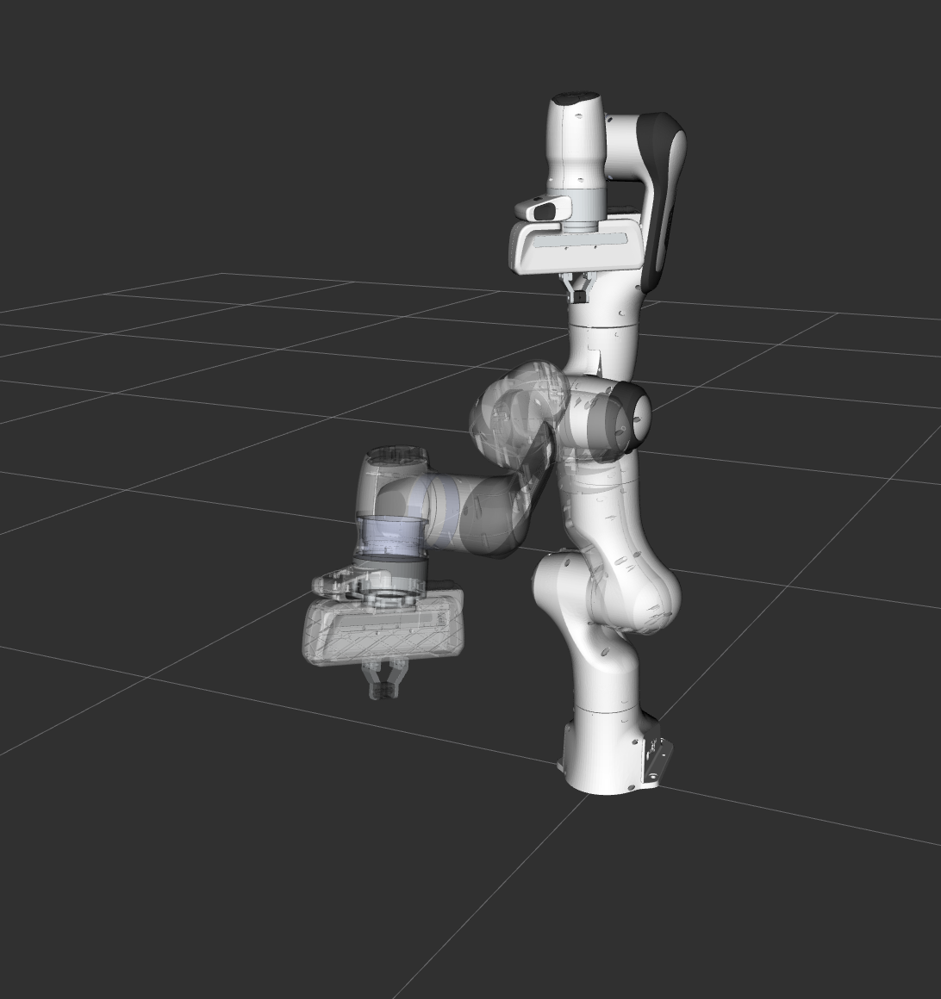
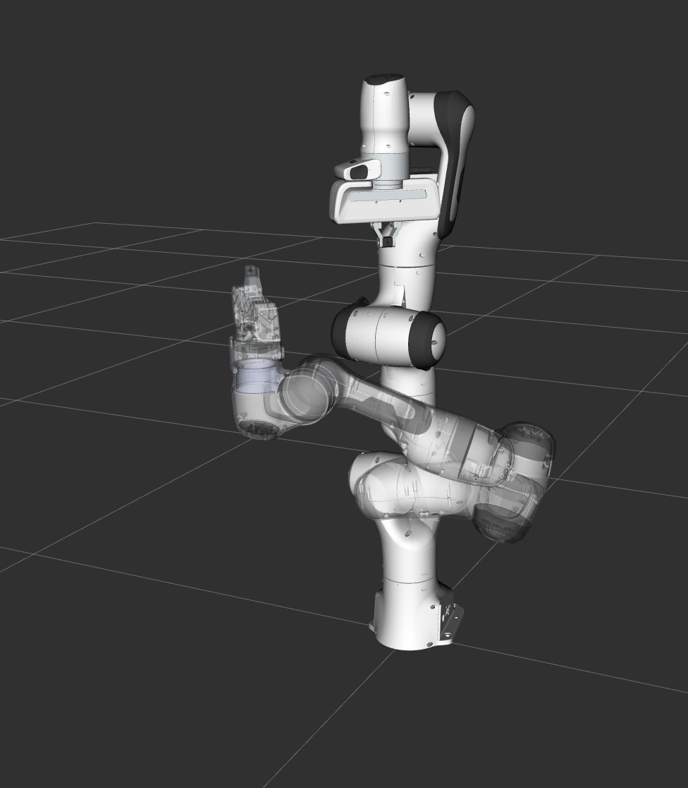

Motion Planning API
==================================

MoveItではモーションプランナーはプラグイン基盤を用いてロードされます．これにより，MoveItは実行時にモーションプランナーをロードすることを可能とします．
このサンプルではこれを実現するために必要なC++コードを見ていきます．

はじめに
---------------
もしまだ済ましていなければ，まず `はじめに <../getting_started/getting_started.html>`_ から始めてください.

デモの実行
----------------
シェルを２つ開き，1つ目のシェルでRVizを立ち上げ，全てが立ち上がるまで待ちます．: ::

  roslaunch panda_moveit_config demo.launch

2つ目のシェルではlaunchファイルを立ち上げます: ::

  roslaunch moveit_tutorials motion_planning_api_tutorial.launch

**注意:** このチュートリアルでは **RvizVisualToolsGui** パネルをデモを通して用います．このパネルをRVizに追加するには， `Visualization Tutorial <../quickstart_in_rviz/quickstart_in_rviz_tutorial.html#rviz-visual-tools>`_　の指示に従ってください．

しばらく経った後，ページ冒頭の画像にあるようなRVizのウィンドウが表示されます．デモの各ステップを続けるには，画面下部の**RvizVisualToolsGui**パネルの**Next**ボタンをクリックするかまたは，画面上部の**Tools**パネル内の**Key Tool**を選択し，RViz上でキーボードの **N**を押してください．

想定される出力
---------------
RViz上で以下の4つの軌道がリプレイされるのが見られるはずです:
 1. ロボットがアームを最初の目標位置に移動

    |A|

 2. ロボットがアームをジョイント目標位置に移動

    |B|

 3. ロボットがアームを元の目標位置に戻す
 4. ロボットがエンドエフェクタの位置を保ちながら，アームを新規目標位置に移動

    |C|

コード全容
---------------
コード全体は:codedir:`こちらの moveit_tutorials のGitHubリポジトリ<motion_planning_api>`から確認出来ます．

.. tutorial-formatter:: ./src/motion_planning_api_tutorial.cpp

Launch ファイル
---------------
すべてのLaunchファイルはGitHub上の :codedir:`こちら<motion_planning_api/launch/motion_planning_api_tutorial.launch>`
から確認できます．また，本チュートリアルに記載されているすべてのソースコードは，MoveItのセットアップ時にダウンロードしてきた
``moveit_tutorials`` パッケージに格納されているものを実行しています．
